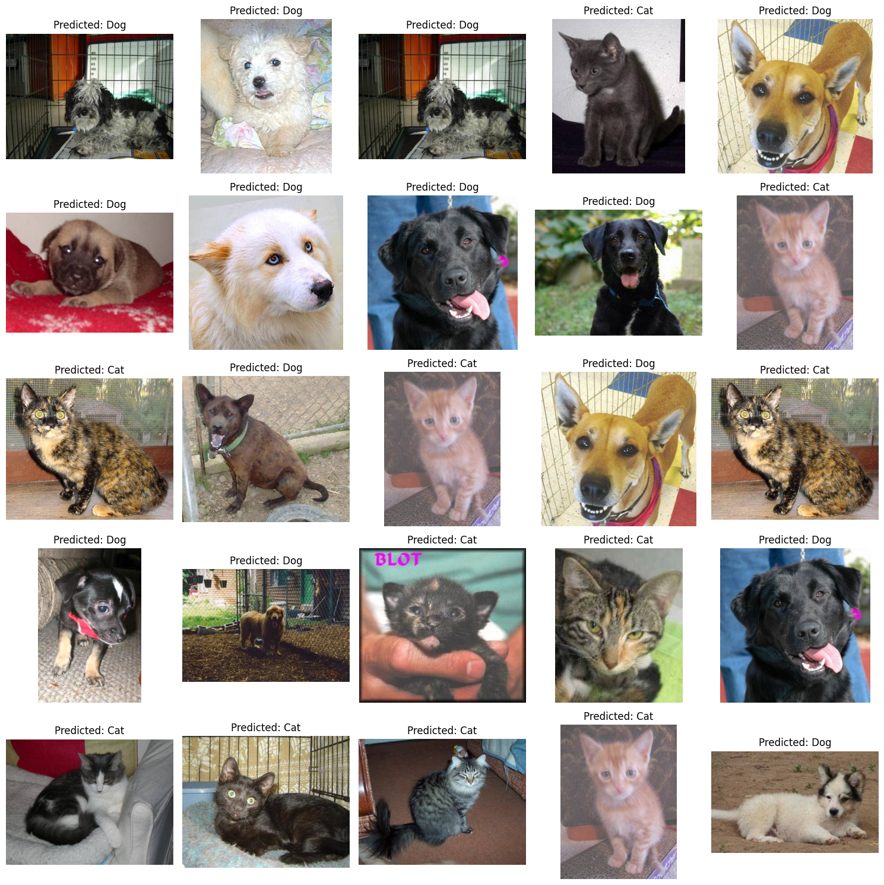

## Cats vs Dogs Image Classification (ResNet50)

This project is a binary image classification model that distinguishes between cats and dogs using transfer learning.

The model is built on top of ResNet50 (pretrained on ImageNet), where the convolutional base is frozen and only a custom classification layer is trained.

### Approach

* Images are loaded using `ImageDataGenerator`
* Applied data augmentation:

  * Zoom
  * Horizontal flip
  * Shear
  * Rotation
  * Brightness adjustment
* Used `preprocess_input` from ResNet50 for normalization
* Data split into training and validation sets (80/20)

### Model

* Base model: ResNet50 (`include_top=False`, `pooling='avg'`)
* Frozen convolutional layers
* Added Dense layer with sigmoid activation for binary classification

### Training

* Loss: Binary Crossentropy
* Optimizer: Adam
* EarlyStopping applied on validation loss
* Training stops automatically when performance stops improving

### Results

The model achieved high validation accuracy (~98%), depending on the data split and training conditions.

### Prediction

After training, the model is used to predict unseen test images.
A sample of predictions is visualized to show model performance on random images.

## Sample Predictions

### Notes

* This project focuses on understanding transfer learning workflow
* Not optimized for production use
* Results may vary depending on dataset and preprocessing
